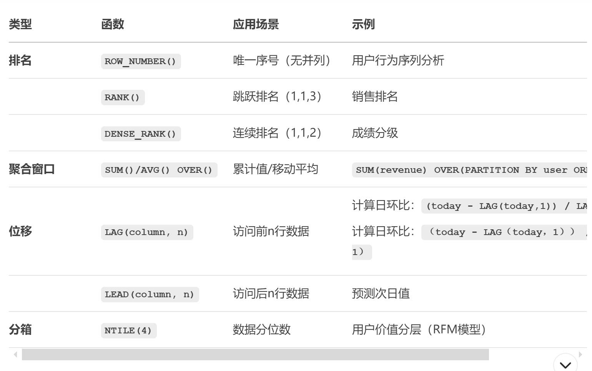

## SQL基础语言
注意： SQL 语句对大小写不敏感
### 创建表
```sql
CREATE TABLE 表名称
(
列名称1 数据类型,
列名称2 数据类型,
列名称3 数据类型,
....
);
```

### 插入数据
```sql
INSERT INTO 表名称 VALUES (值1, 值2,....);

--可以指定所要插入数据的列：
INSERT INTO table_name (列1, 列2,...) VALUES (值1, 值2,....);
```

### 查询数据
星号（*）是选取所有列的快捷方式。
```sql
SELECT * FROM 表名称;

--可以指定所要查询数据的列
SELECT 列名称 FROM 表名称;
```

### 去除重复值
```sql
SELECT DISTINCT 列名称 FROM 表名称;
```

### 条件过滤
```sql
SELECT 列名称 FROM 表名称 WHERE 列 运算符 值;
```

### AND & OR 运算符
```sql
--如果第一个条件和第二个条件都成立，则 AND 运算符显示一条记录。
SELECT * FROM 表名称 WHERE 列 运算符 值 AND 列 运算符 值;

--如果第一个条件和第二个条件中只要有一个成立，则 OR 运算符显示一条记录。
SELECT * FROM 表名称 WHERE 列 运算符 值 OR 列 运算符 值;
```

### 排序
```sql
--默认按照升序对记录进行排序,如果您希望按照降序对记录进行排序，可以使用 DESC 关键字。
SELECT * FROM 表名称 ORDER BY 列1,列2 DESC;
```

### 更新数据
```sql
UPDATE 表名称 SET 列名称 = 新值 WHERE 列名称 = 某值;
```

### 删除数据
```sql
DELETE FROM 表名称 WHERE 列名称 = 值;
```

### 清除表数据
```sql
--仅仅删除表格中的数据
TRUNCATE TABLE 表名称;
```

### 删除表
```sql
--表的结构、属性以及索引也会被删除
DROP TABLE 表名称;
```

## SQL 高级语言
标准的聚合函数有avg、count、sum、max和min

###  查找类似值
```sql
SELECT 列名/(*) FROM 表名称 WHERE 列名称 LIKE 值;
```

### 锁定多个值
```sql
--IN 操作符允许我们在 WHERE 子句中规定多个值。
SELECT 列名/(*) FROM 表名称 WHERE 列名称 IN (值1,值2,值3);
```

### 选取区间数据
```sql
--操作符 BETWEEN … AND 会选取介于两个值之间的数据范围。这些值可以是数值、文本或者日期。
SELECT 列名/(*) FROM 表名称 WHERE 列名称 BETWEEN 值1 AND 值2;
```

###  别名
```sql
--通过使用 SQL，可以为列名称和表名称指定别名（Alias），别名使查询程序更易阅读和书写。

--表别名
SELECT 列名称/(*) FROM 表名称 AS 别名;

--列别名
SELECT 列名称 as 别名 FROM 表名称;
```

### 多表关联
```sql
select 列名
from 表A
INNER|LEFT|RIGHT|FULL JOIN 表B
ON 表A主键列 = 表B外键列;

-- 不同的 SQL JOIN：
-- JOIN: 如果表中有至少一个匹配，则返回行
-- INNER JOIN: 内部连接，返回两表中匹配的行
-- LEFT JOIN: 即使右表中没有匹配，也从左表返回所有的行
-- RIGHT JOIN: 即使左表中没有匹配，也从右表返回所有的行
-- FULL JOIN: 只要其中一个表中存在匹配，就返回行
```

### 合并结果集
```sql
--UNION 操作符用于合并两个或多个 SELECT 语句的结果集。
SELECT 列名 FROM 表A
UNION
SELECT 列名 FROM 表B;

--注意：UNION 操作符默认为选取不同的值。如果查询结果需要显示重复的值，请使用 UNION ALL。
```

### 非空
```sql
--NOT NULL 约束强制列不接受 NULL 值。
--NOT NULL 约束强制字段始终包含值。这意味着，如果不向字段添加值，就无法插入新记录或者更新记录。
CREATE TABLE 表
(
列 int NOT NULL
);

```
### 视图
```sql
--在 SQL 中，视图是基于 SQL 语句的结果集的可视化的表。
--视图包含行和列，就像一个真实的表。
CREATE VIEW 视图名 AS
SELECT 列名
FROM 表名
WHERE 查询条件;

--更新视图
CREATE OR REPLACE VIEW 视图名 AS
SELECT 列名
FROM 表名
WHERE 查询条件;

```

## SQL常用函数
### 平均值
```sql
--AVG 函数返回数值列的平均值。NULL 值不包括在计算中。
SELECT AVG(列名) FROM 表名;
```

### 汇总行数
```sql
--COUNT() 函数返回匹配指定条件的行数。
SELECT COUNT(*) FROM 表名;
SELECT COUNT(DISTINCT 列名) FROM 表名;
SELECT COUNT(列名) FROM 表名;
```

### 最大值
```sql
--MAX 函数返回一列中的最大值。NULL 值不包括在计算中。
SELECT MAX(列名) FROM 表名;
```

### 最小值
```sql
--MIN 函数返回一列中的最小值。NULL 值不包括在计算中。
SELECT MIN(列名) FROM 表名;
```

### 求和
```sql
--SUM 函数返回数值列的总数（总额）。
SELECT SUM(列名) FROM 表名;
```

### 分组
```sql
--GROUP BY 语句用于结合合计函数，根据一个或多个列对结果集进行分组。
SELECT 列名A, 统计函数(列名B)
FROM 表名
WHERE 查询条件
GROUP BY 列名A;
```

### 句尾连接
```sql
--在 SQL 中增加 HAVING 子句原因是，WHERE 关键字无法与合计函数一起使用。
SELECT 列名A, 统计函数(列名B)
FROM table_name
WHERE 查询条件
GROUP BY 列名A
HAVING 统计函数(列名B) 查询条件;
```

### 大写
```sql
--UCASE/UPPER 函数把字段的值转换为大写。
select upper(列名) from 表名;
```

### 小写
```sql
--LCASE/LOWER 函数把字段的值转换为小写。
select lower(列名) from 表名;
```

### 获取长度
```sql
--LEN/LENGTH 函数返回文本字段中值的长度。
select length(列名) from 表名;
```

### 数值取舍
```sql
--ROUND 函数用于把数值字段舍入为指定的小数位数。
select round(列名,精度) from 表名;
```

### 当前时间
```sql
--NOW/SYSDATE 函数返回当前的日期和时间。
select sysdate from 表名;
```

### 窗口函数
```sql
SELECT 
  column1,
  [窗口函数] OVER (
    PARTITION BY category --按照category 列的值进行分组
    ORDER BY time_column --按照 time_column 列的值进行排序。
    ROWS BETWEEN 3 PRECEDING AND CURRENT ROW -- 滑动窗口
  ) AS metric
FROM table

```

四大函数类型：
1. 聚合函数
2. 排名函数
3. 位移函数
4. 分布函数
